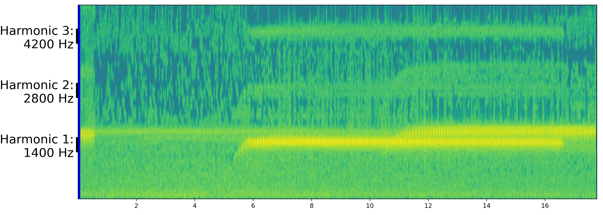

# fluid-mechanics-frog
Append a spectrogram and perform fluid mechanics calculations over a popular frog video

<a href="https://www.youtube.com/watch?v=HNv2prl0WOM&feature=youtu.be">LINK TO THE VIDEO</a>
 
<h2><b>Can we find out the size of the Toad by calculating the water's wavelength using the correct <a href="https://en.wikipedia.org/wiki/Dispersion_relation">dispersion relation</a>?</b></h2>
 

 
<h2><b>Obtaining the fundamental frequency of the excitation: calculating a <a href="https://en.wikipedia.org/wiki/Spectrogram">spectrogram</a></b></h2>
 

 
<h2><b>Solving for the wavelength in the <a href="https://en.wikipedia.org/wiki/Capillary_wave">capillary</a> regime of waves yields a value for the toad of 6 milimeters</b></h2>
 

 
<h2><b>The value obtained is off by an order of magnitude, as the American Toad has a size of approximately 6cm</b></h2>
 

 
<h2><b>What was wrong with the calculation?</b></h2>
 

* <b>relative angles and perspective:</b> these effects cannot account for an order of magnitude.

* <b>viscosity in capillary waves:</b> below 5kHz it can be neglected<a href="https://www.sciencedirect.com/science/article/abs/pii/S0165212510000806">[1]</a>

* <b>Faraday Waves:</b> using the capillary waves dispersion relation and solving the inverse problem (i.e. forcing the toad's size to be 6cm) yields a frequency of 340 Hz. Here the fundamental frequency was set to between 1.4kHz and 1.5kHz. Faraday sub-modal waves could account for this phenomena, the final picture being the toad and the air vibrating at ~1.4Khz and the water responding to the toad's vibration at 350Hz. As an argument against it, no explicit mention to <i>CIRCULAR</i> Faraday Waves has been encountered in the bibliography research<a href="https://journals.aps.org/pre/abstract/10.1103/PhysRevE.100.053106">[2]</a><a href="https://www.cambridge.org/core/journals/journal-of-fluid-mechanics/article/subharmonic-capillarygravity-waves-in-large-containers-subject-to-horizontal-vibrations/83FD4B29CEFC16C82139623944F5FCE6">[3]</a>
